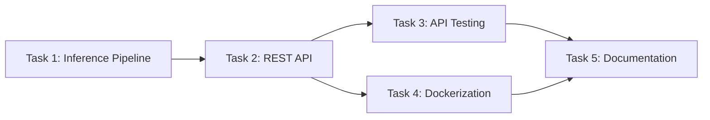

## Plan: Phase 2 Bangladeshi Taka Detection API & Deployment

This plan transforms the Phase 1 trained YOLOv12 model into a production-ready REST API with Docker containerization, comprehensive testing, and deployment documentation. The implementation leverages existing Phase 1 inference patterns while adding FastAPI endpoints, Pydantic validation, and container orchestration to serve the 9-class currency detection model.

### Steps

1. **Set up inference pipeline module** — Create [phase2/api/detector.py](phase2/api/detector.py) wrapping the YOLO model loading and prediction logic from Phase 1's training notebook, returning structured detection results with denomination names, confidence scores, and bounding boxes.

2. **Implement FastAPI REST API** — Build [phase2/api/main.py](phase2/api/main.py) with `/predict` POST endpoint accepting JPEG/PNG uploads, `/health` for container probes, and `/` root info; add Pydantic schemas in [phase2/api/schemas.py](phase2/api/schemas.py) for request/response validation.

3. **Update dependencies** — Extend [requirements.txt](requirements.txt) with `fastapi`, `uvicorn[standard]`, `python-multipart`, `pytest`, `httpx` (no version pinning as specified).

4. **Configure Docker containerization** — Populate [phase2/docker/Dockerfile](phase2/docker/Dockerfile) using `python:3.11-slim` base image, copy model weights from `phase2/model_weights/best.pt`, expose port 8000; complete [phase2/docker/docker-compose.yml](phase2/docker/docker-compose.yml) with volume mounts and health checks.

5. **Build comprehensive test suite** — Implement [phase2/tests/test_api.py](phase2/tests/test_api.py) with pytest fixtures covering 5+ test images, validating response format, HTTP status codes, and prediction accuracy; add sample test images to [phase2/tests/test_images/](phase2/tests/test_images/).

6. **Write deployment documentation** — Create [phase2/README_PHASE2.md](phase2/README_PHASE2.md) with Docker build/run commands, API usage examples, endpoint specifications; populate [phase2/deployment/ENV_TEMPLATE](phase2/deployment/ENV_TEMPLATE) with configurable environment variables.

### Further Considerations

1. **GPU vs CPU inference?** — Docker image can use `python:3.11-slim` for CPU-only (lighter, ~1GB) or `nvidia/cuda:12.1-runtime-ubuntu22.04` for GPU support (~5GB); recommend CPU for portability unless high-throughput is needed.

2. **Confidence threshold configuration?** — Expose as query parameter on `/predict?confidence=0.25` or environment variable `DETECTION_CONFIDENCE_THRESHOLD`; default 0.25 matches Phase 1 training.

3. **Annotated image return option?** — Add optional `return_annotated_image=true` query parameter to include base64-encoded visualization in response; useful for debugging but increases response size significantly.

---

## Proposed Phase 2 Folder Structure

```
phase2/
├── api/
│   ├── __init__.py
│   ├── main.py              # FastAPI application with endpoints
│   ├── detector.py          # YOLO model wrapper class
│   ├── schemas.py           # Pydantic request/response models
│   └── config.py            # Settings and environment config
├── deployment/
│   ├── ENV_TEMPLATE         # Environment variables template
│   └── DEPLOYMENT.md        # Deployment instructions
├── docker/
│   ├── Dockerfile           # Container build configuration
│   ├── docker-compose.yml   # Service orchestration
│   └── .dockerignore        # Build exclusions
├── docs/
│   └── API_DOCUMENTATION.md # Endpoint specifications
├── model_weights/
│   ├── best.pt              # ✅ Already present
│   ├── last.pt              # ✅ Already present
│   └── ...
├── tests/
│   ├── __init__.py
│   ├── conftest.py          # Pytest fixtures
│   ├── test_api.py          # API endpoint tests
│   ├── test_detector.py     # Unit tests for detector
│   └── test_images/         # 5+ sample test images
│       ├── 100_taka.jpg
│       ├── 500_taka.jpg
│       └── ...
└── README_PHASE2.md         # Phase 2 documentation
```

---

## Updated requirements.txt

```
ultralytics
supervision
matplotlib
numpy
Pillow
pyyaml
ipykernel
fastapi
uvicorn[standard]
python-multipart
pytest
httpx
```

---

## API Endpoint Specifications

| Endpoint | Method | Input | Output | Status Codes |
|:---------|:-------|:------|:-------|:-------------|
| `/` | GET | None | API info, version, model info | 200 |
| `/health` | GET | None | `{"status": "healthy"}` | 200 |
| `/predict` | POST | `multipart/form-data` image file (JPEG/PNG) | Detection JSON | 200, 400, 422, 500 |

### `/predict` Response Schema

```json
{
  "success": true,
  "detections": [
    {
      "class_id": 7,
      "class_name": "one hundred taka",
      "denomination": "৳100",
      "confidence": 0.923,
      "bbox": {"x1": 120.5, "y1": 85.3, "x2": 450.2, "y2": 320.8}
    }
  ],
  "count": 1,
  "image_size": {"width": 640, "height": 480},
  "processing_time_ms": 45.2
}
```

### Error Response Schema

```json
{
  "success": false,
  "error": "Invalid image format. Supported: JPEG, PNG",
  "detail": "Content-Type must be image/jpeg or image/png"
}
```

---

## Docker Strategy

| Component | Configuration |
|:----------|:--------------|
| **Base Image** | `python:3.11-slim` (CPU) |
| **Working Dir** | `/app` |
| **Model Path** | `/app/model_weights/best.pt` |
| **Exposed Port** | `8000` |
| **Entry Command** | `uvicorn api.main:app --host 0.0.0.0 --port 8000` |
| **Health Check** | `curl -f http://localhost:8000/health` |

---

## Task Integration Dependencies



| Task | Dependencies | Outputs Used By |
|:-----|:-------------|:----------------|
| Task 1 | Phase 1 model weights | Task 2, Task 4 |
| Task 2 | Task 1 detector module | Task 3, Task 4 |
| Task 3 | Task 2 running API | Task 5 (screenshots) |
| Task 4 | Task 1 + Task 2 code | Task 5 (commands) |
| Task 5 | All tasks complete | Final deliverable |

---

## Potential Challenges & Mitigations

| Challenge | Mitigation |
|:----------|:-----------|
| Large model file (~50MB) in Docker | Use `.dockerignore` for dev files; consider multi-stage build |
| YOLO first inference cold start (~3-5s) | Pre-load model on API startup via FastAPI lifespan event |
| Image validation edge cases | Use Pillow to validate before YOLO; return 400 for corrupt files |
| Test image availability | Copy 5 diverse samples from `phase1/dataset/filtered/test/images/` |
| Cross-platform Docker paths | Use forward slashes and relative paths in Dockerfile |

---

## Quick Reference Checklist

### Task 1: Inference Pipeline ☐
- [ ] Create `phase2/api/detector.py` with `TakaDetector` class
- [ ] Implement `load_model()` method loading `best.pt`
- [ ] Implement `predict(image)` returning detections list
- [ ] Map class IDs to denomination names (9 classes)
- [ ] Create sample inference script demonstrating output

### Task 2: REST API ☐
- [ ] Initialize FastAPI app in `main.py`
- [ ] Define Pydantic schemas in `schemas.py`
- [ ] Implement `POST /predict` with file upload
- [ ] Add `GET /health` endpoint
- [ ] Add `GET /` root info endpoint
- [ ] Handle errors with proper HTTP status codes

### Task 3: API Testing ☐
- [ ] Select 5+ test images from Phase 1 dataset
- [ ] Create pytest fixtures in `conftest.py`
- [ ] Write `test_predict_valid_image()`
- [ ] Write `test_predict_invalid_file()`
- [ ] Write `test_health_endpoint()`
- [ ] Capture Postman/curl screenshots
- [ ] Document prediction accuracy observations

### Task 4: Dockerization ☐
- [ ] Write Dockerfile with Python 3.11-slim base
- [ ] Create `.dockerignore` file
- [ ] Configure `docker-compose.yml`
- [ ] Build image: `docker build -t bd-taka-detector .`
- [ ] Run container: `docker run -p 8000:8000 bd-taka-detector`
- [ ] Verify API accessibility from host
- [ ] Capture running container screenshot/log

### Task 5: Documentation ☐
- [ ] Complete `README_PHASE2.md` with all sections
- [ ] Fill `ENV_TEMPLATE` with variables
- [ ] Add code comments throughout
- [ ] Document Docker build/run commands
- [ ] Create API usage examples with curl
- [ ] Verify folder structure is organized
- [ ] Prepare final submission package

---

## Currency Classes Reference

```python
CLASSES = [
    "500 taka",           # 0 - ৳500
    "Fifty taka",         # 1 - ৳50
    "Five Taka",          # 2 - ৳5
    "One Taka",           # 3 - ৳1
    "One Thousand taka",  # 4 - ৳1000
    "Ten Taka",           # 5 - ৳10
    "Twenty",             # 6 - ৳20
    "one hundred taka",   # 7 - ৳100
    "two taka"            # 8 - ৳2
]

DENOMINATION_MAP = {
    0: "৳500",
    1: "৳50",
    2: "৳5",
    3: "৳1",
    4: "৳1000",
    5: "৳10",
    6: "৳20",
    7: "৳100",
    8: "৳2"
}
```
